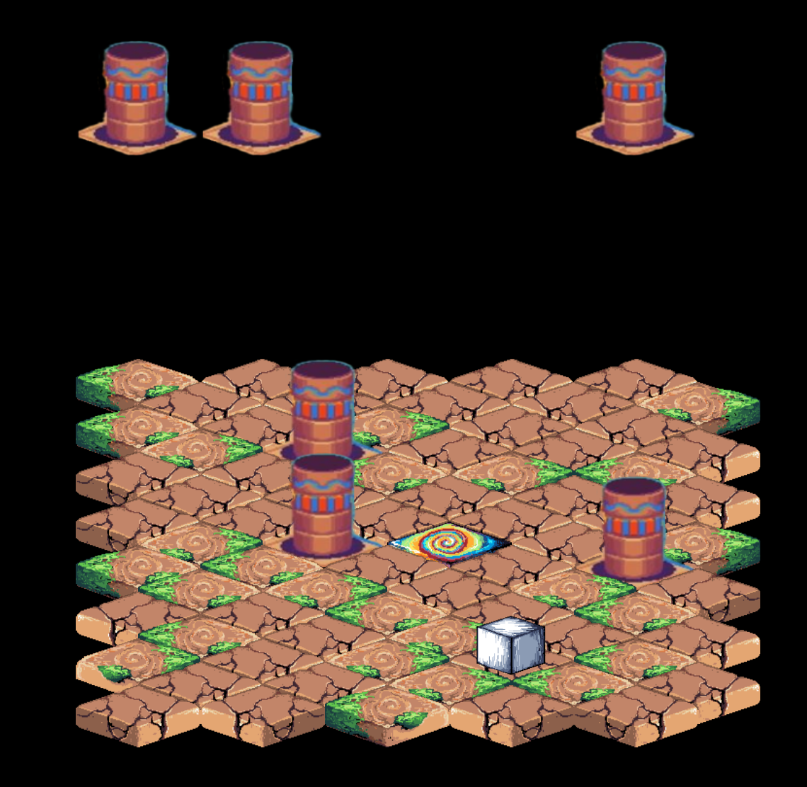

# GMTK Game Jam 2022

## Description
This project contains our game idea for the GMTK Game Jam 2022.

  

## Table of Contents
1. [List of Features](#list-of-features)
2. [Installation](#installation)
3. [Usage](#usage)
4. [Contributing](#contributing)
5. [Credits](#credits)
6. [License](#license)

## List of Features

## Installation

1. install latest version of Node and npm
2. run `npm install` in the top-level directory of this project

### Dependencies

These libraries are needed:
- [Node](https://nodejs.org/en/)
- [npm](https://www.npmjs.com) (usually included in Node)
- [three.js](https://threejs.org)
- [rollup](https://rollupjs.org/guide/en/)

## Usage

Here is a list of all usage options.

- run `npm run build` to build the bundle in production mode
- run `npm run watch` to build the bundle in developer mode and watch the source directory
- run `npm run dev` to build the bundle in developer mode and start a dev server with live reload
- run `npm run prod` to build the bundle in production mode and start a server
- run `npm run start` to start a server

If you are developing, you probably want to use `npm run dev`.

## Contributing

We encourage you to contribute to this project, in form of bug reports, feature requests
or code additions. Although it is likely that your contribution will not be implemented.

Please check out the [contribution](docs/CONTRIBUTING.md) guide for guidelines about how to proceed
as well as a style guide.

## Credits
This project was developed by:
- [ArielMant0](https://github.com/ArielMant0)
- [Hannah](https://github.com/htscode)
- [lwarnking](https://github.com/lwarnking)
- [rwarnking](https://github.com/rwarnking)
- Annalena
- Ellen
- [HendrikBrueckler](https://github.com/HendrikBrueckler)

## License
This project is licensed under the [MIT License](LICENSE).
